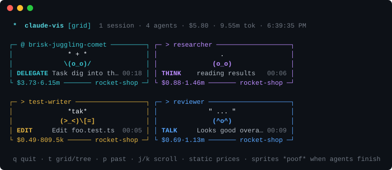
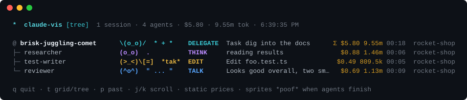
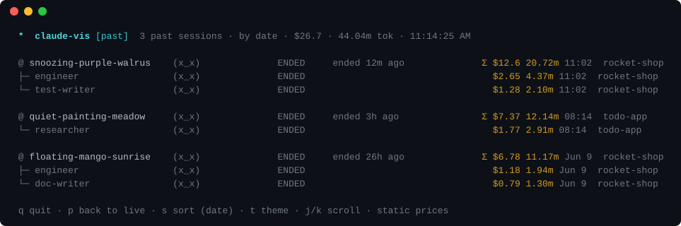
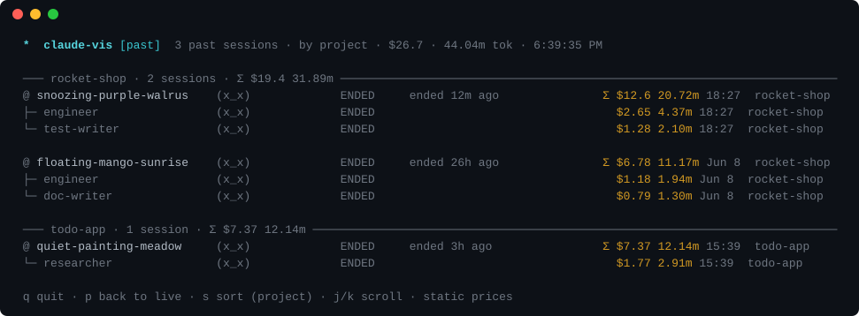

# claude-vis

Watch your Claude Code agents come to life in the terminal. Every live session
and subagent gets a little animated sprite that thinks `.oO(?)`, reads `(o_o)[#]`,
types `(>_<)/[=]`, runs commands `(o_o)>_`, and goes `*poof*` when it finishes.



## Install

```sh
brew install turleynerd/tap/claude-vis
```

Self-contained binary (macOS/Linux, arm64/x64) — no Node required. Running
from a source checkout with `node index.js` (Node ≥18) works too.

## Usage

```sh
claude-vis                       # watch everything active in the last 5 min
claude-vis --project rocket      # only sessions whose project path matches
claude-vis --window 15           # widen the activity window to 15 minutes
claude-vis --tree                # start in tree view
claude-vis --past                # start in the past-sessions view
claude-vis --sort cost           # order past sessions by cost instead of date
claude-vis --sort project        # group past sessions by project directory
claude-vis --theme cats          # sprite theme (see Themes below)
claude-vis --once                # print one frame and exit (no TUI)
```

Keys: `v` toggles grid/tree, `p` toggles the past-sessions view, `t` opens
the sprite-theme picker (arrow keys to preview live, enter to keep, esc to
cancel), `s` cycles past ordering (date / cost / project), `q` quits. The
tree and past views scroll with `j`/`k`, the arrow keys, or the mouse wheel —
`ctrl-d`/`ctrl-u` and PgDn/PgUp jump half a page, `g`/`G` jump to top/bottom.

## Tree view

The tree nests each subagent under the session that spawned it, with one row
per agent: sprite, state, what it's doing right now, and a running cost — the
`Σ` on the session row spans the whole team.



The bottom of the screen also shows a live activity ticker of recent events
(tool calls, spawns, finishes) across all agents.

## Past sessions

Press `p` for your history: the most recent finished sessions (capped at 15)
in the same tree layout — when each ended, what it cost in dollars and
tokens, and its priciest subagents nested under it.



Sorting by project (`s`, or `--sort project`) groups sessions by directory
and rolls the cost up into the group headers — a quick answer to "what has
each project cost me lately?":



Past tallies are scanned lazily — one transcript per tick — so a deep history
never stalls the animation.

## Costs

Every tally is computed from the `usage` blocks in the agent's transcript,
deduped by request ID, with cache reads/writes priced separately. Pre-existing
sessions are scanned in full at startup, so totals reflect the whole session,
not just what happened since launch.

Per-model prices are fetched at launch from [LiteLLM](https://github.com/BerriAI/litellm)'s
community-maintained [model pricing sheet](https://github.com/BerriAI/litellm/blob/main/model_prices_and_context_window.json)
(there is no official Anthropic pricing API — thanks to the LiteLLM folks for
keeping this data current), and existing tallies are repriced when the fetch
lands. If the fetch fails or a model isn't listed yet, a built-in per-family
table is used instead — the footer shows whether `live` or `static` prices
are in effect.

## States

| Sprite        | State    | Trigger                                      |
| ------------- | -------- | -------------------------------------------- |
| `.oO(?) (o_O)`| THINK    | thinking block, or processing a tool result   |
| `(o_o) [#]`   | READ     | Read / Grep / Glob / WebFetch / WebSearch     |
| `(>_<)/[=]`   | EDIT     | Edit / Write / NotebookEdit                   |
| `(o_o)>_`     | RUN      | Bash and other tools                          |
| `\(o_o)/ *`   | DELEGATE | Task / Agent (spawning a subagent)            |
| `(^o^) "..."` | TALK     | streaming a text response                     |
| `(-_-) zZz`   | IDLE     | no transcript activity for 20s                |
| `(x_x)`       | DONE     | agent finished — sprite poofs away            |

## Themes

Not a people person? `--theme <name>`, or press `t` for a picker that
previews each theme live on your running agents. A theme re-skins every
sprite — the animations, props, and *poof* stay the same:

| Theme    | Working   | Editing       | Happy     | Done      |
| -------- | --------- | ------------- | --------- | --------- |
| `people` | `(o_o)`   | `(>_<)/[=]`   | `(^o^)`   | `(x_x)`   |
| `bots`   | `[o_o]`   | `[>_<]/[=]`   | `[^o^]`   | `[x_x]`   |
| `cats`   | `(=o.o=)` | `(=>.<=)/[=]` | `(=^o^=)` | `(=x.x=)` |
| `owls`   | `{o,o}`   | `{>,<}/[=]`   | `{^,^}`   | `{x,x}`   |
| `ghosts` | `(~o_o)~` | `(~>_<)~/[=]` | `(~^o^)~` | `(~x_x)~` |

## How it works

Claude Code writes session transcripts as JSONL to `~/.claude/projects/`
(subagents get their own files under `<session-id>/subagents/`). claude-vis
tails those files and animates each agent based on the latest event — no
hooks, no config, and no changes needed in the session being watched.

A session *poofs* as soon as its Claude process disappears from the process
table (closing Claude is detected within ~10s, via `--session-id`/`--resume`
in argv or a claude binary whose cwd is the project root). Sessions whose
process can't be identified fall back to timers: subagents despawn after 90s
of silence, main sessions after 10 minutes.

Set `CLAUDE_VIS_PROJECTS_DIR` to watch a directory other than
`~/.claude/projects` (handy for demos and testing). The screenshots above are
real frames rendered against a synthetic fixture of placeholder projects —
regenerate them with `node scripts/readme-svgs.js`.
